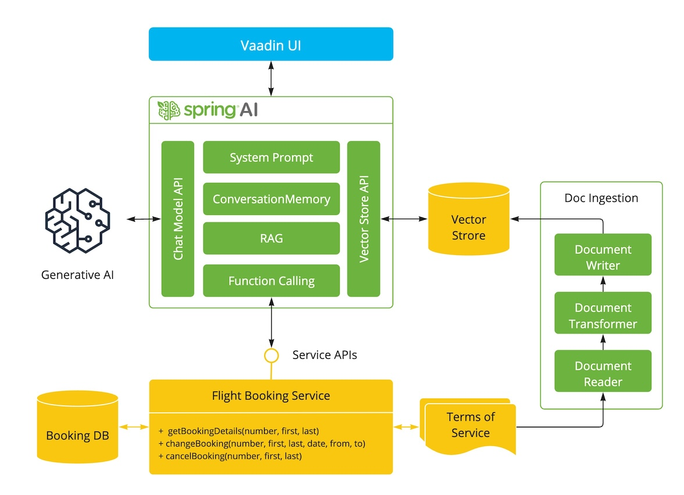

# AI powered expert system demo

Spring AI re-implementation of https://github.com/marcushellberg/java-ai-playground

This app shows how you can use [Spring AI](https://github.com/spring-projects/spring-ai) to build an AI-powered system that:

- Has access to terms and conditions (retrieval augmented generation, RAG)
- Can access tools (Java methods) to perform actions (Function Calling)
- Uses an LLM to interact with the user



## Requirements

- Java 17+
- OpenAI API key in `OPENAI_API_KEY` environment variable

## Running

Run the app by running `Application.java` in your IDE or `mvn` in the command line.

### With OpenAI Chat

Add to the POM the Spring AI Open AI boot starter:

```xml
<dependency>
    <groupId>org.springframework.ai</groupId>
    <artifactId>spring-ai-openai-spring-boot-starter</artifactId>
</dependency>
```

Add the OpenAI configuraiton to the `applicaiton.properties`:

```
spring.ai.openai.api-key=${OPENAI_API_KEY}
spring.ai.openai.chat.options.model=gpt-4o
```

### WIth VertexAI Geminie Chat

Add to the POM the Spring AI VertexAI Gemeni and Onnx Transfomer Embedding boot starters:

```xml
<dependency>
    <groupId>org.springframework.ai</groupId>
    <artifactId>spring-ai-vertex-ai-gemini-spring-boot-starter</artifactId>
</dependency>

<dependency>
    <groupId>org.springframework.ai</groupId>
    <artifactId>spring-ai-transformers-spring-boot-starter</artifactId>
</dependency>
```

Add the VertexAI Gemini configuraiton to the `applicaiton.properties`:

```
spring.ai.vertex.ai.gemini.project-id=${VERTEX_AI_GEMINI_PROJECT_ID}
spring.ai.vertex.ai.gemini.location=${VERTEX_AI_GEMINI_LOCATION}
spring.ai.vertex.ai.gemini.chat.options.model=gemini-1.5-pro-001
# spring.ai.vertex.ai.gemini.chat.options.model=gemini-1.5-flash-001
```

### With Azure OpenAI Chat

Add to the POM the Spring AI Azure OpenAI boot starter:

```xml
<dependency>
    <groupId>org.springframework.ai</groupId>
    <artifactId>spring-ai-azure-openai-spring-boot-starter</artifactId>
</dependency>
```

Add the Azure OpenAI configuraiton to the `applicaiton.properties`:

```
spring.ai.azure.openai.api-key=${AZURE_OPENAI_API_KEY}
spring.ai.azure.openai.endpoint=${AZURE_OPENAI_ENDPOINT}
spring.ai.azure.openai.chat.options.deployment-name=gpt-4o
```

### With Groq Chat

It reuses the OpenAI Chat client but ponted to the Groq endpont

Add to the POM the Spring AI Open AI boot starter:

```xml
<dependency>
    <groupId>org.springframework.ai</groupId>
    <artifactId>spring-ai-openai-spring-boot-starter</artifactId>
</dependency>
<dependency>
    <groupId>org.springframework.ai</groupId>
    <artifactId>spring-ai-transformers-spring-boot-starter</artifactId>
</dependency>
```

Add the Groq configuraiton to the `applicaiton.properties`:

```
spring.ai.openai.api-key=${GROQ_API_KEY}
spring.ai.openai.base-url=https://api.groq.com/openai
spring.ai.openai.chat.options.model=llama3-70b-8192
```

### With Anthropic Claude 3 Chat

Add to the POM the Spring AI Anthropic Claude and Onnx Transfomer Embedding boot starters:

```xml
<dependency>
    <groupId>org.springframework.ai</groupId>
    <artifactId>spring-ai-anthropic-spring-boot-starter</artifactId>
</dependency>

<dependency>
    <groupId>org.springframework.ai</groupId>
    <artifactId>spring-ai-transformers-spring-boot-starter</artifactId>
</dependency>
```

Add the Anthropic configuration to the `application.properties`:

```
spring.ai.anthropic.api-key=${ANTHROPIC_API_KEY}
spring.ai.openai.chat.options.model=llama3-70b-8192
spring.ai.anthropic.chat.options.model=claude-3-5-sonnet-20240620
```


## Build Jar

```shell
./mvnw clean install -Pproduction
```

```shell
java -jar ./target/playground-flight-booking-0.0.1-SNAPSHOT.jar
```


```
docker run -it --rm --name postgres -p 5432:5432 -e POSTGRES_USER=postgres -e POSTGRES_PASSWORD=postgres ankane/pgvector
```